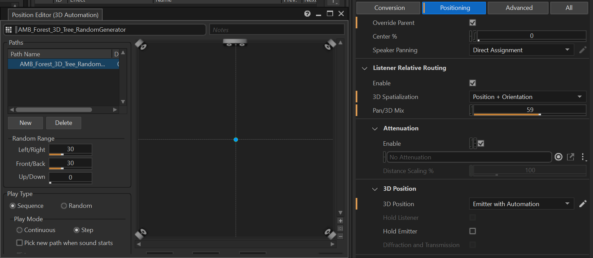
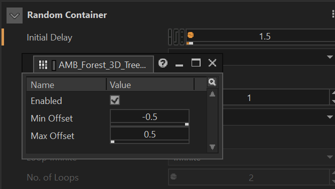
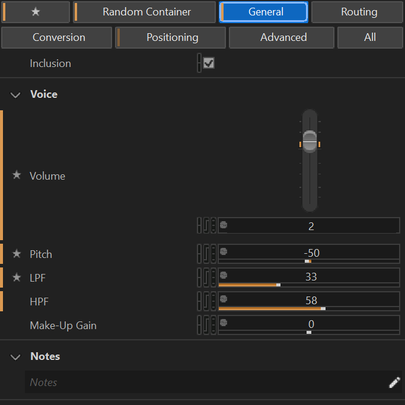
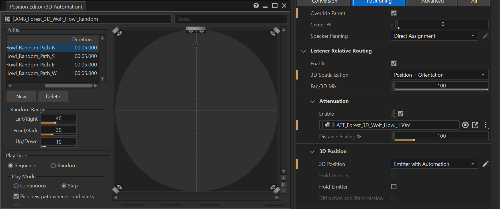
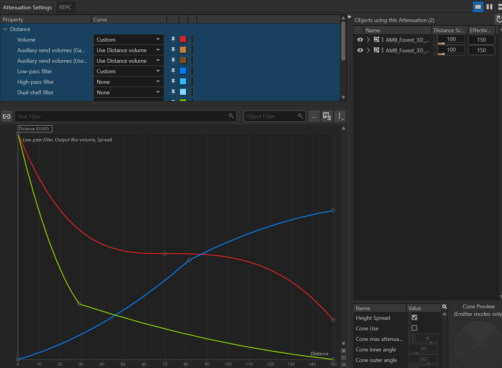
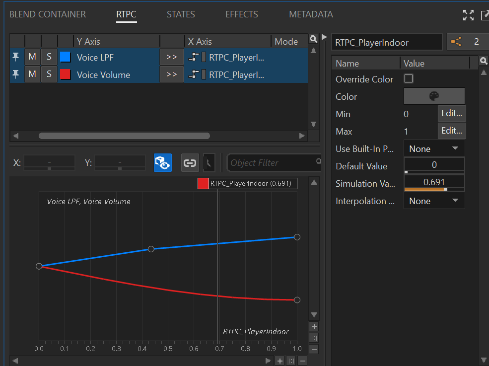
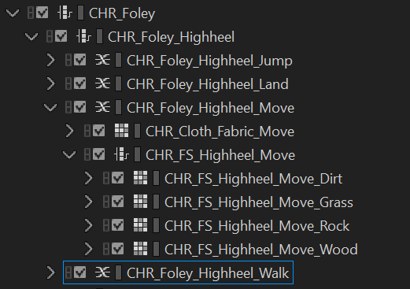
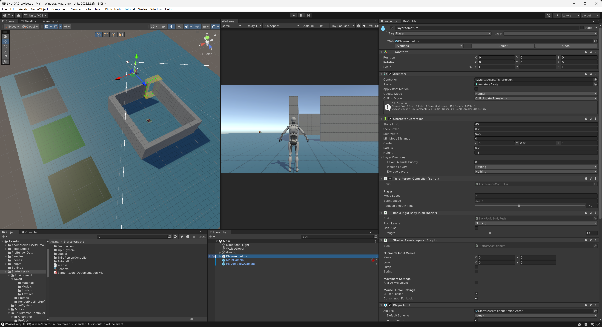

# Unity-Wwise 游戏音频设计作品说明报告

## 作品概述

本作品基于 Unity 与 Wwise 音频中间件完成一个可运行的第三人称音频交互场景，围绕作业要求中的四个核心模块进行设计：空间音频 Room/Portal、森林环境声 Ambience、室内篝火 3D Object，以及角色脚步 Character Foley。项目主场景位于 `SHU_GAD_WwiseLab/Assets/Scenes/Main.unity`，Wwise 工程位于 `SHU_GAD_WwiseLab/SHU_GAD_WwiseLab_WwiseProject`。

场景被设计为室外森林空地与室内空间相连的结构。室外空间播放森林环境声，室内空间设置混响，门洞处使用 Portal 表达室内外连通关系。玩家角色在四种地表 Dirt、Grass、Rock、Wood 上移动时，通过动画事件触发脚步声，并由 Raycast 检测当前地表类型后切换 Wwise Switch。

## 挑战

本次作业最大的挑战竟然不是在声音设计，而是在 Wwise 2025 LTS 的使用和与 Unity 的集成上。Wwise 2025 LTS 大幅更改了界面的排布逻辑，导致在设计的时候需要不断去翻文档，寻找教程里的功能在新版本中的位置。同时，Wwise 与 Unity 的集成也需要一定的适应过程。区别于 Unreal 里提供了各类 Actor，Unity 中的 Wwise 集成里并没有提供现成的 Room、Portal 等 GameObject Prefab，而需要自己去使用 AkRoomAwareObject、AkRoomPortal 等 Component 来搭建 Room/Portal 的功能，这个过程也需要不断地去查阅文档和教程，才能正确实现空间音频的效果，但确实也带来了更高的自由度。

## Wwise 音频设计

### 环境声 Ambience

环境声资产以 `AMB_Forest_Outdoor` 的 Blend Container 为主容器。希望构建一个夏夜森林的声景。

#### AMB_Forest_2D_Bed_Blend

AMB_Forest_2D_Bed_Blend 包含两条持续循环的室外通用底噪素材 `AMB_2D_EXT_GEN` 和环境声素材 `AMB_Forest_2D_Insect_Group_Night`，通过 Blend Container 混合播放，提供稳定的环境基底。此处没有使用 `AMB_Forest_2D_Wind_Gentle` 这条 Loop 素材。风声将会以树被吹动的形式，使用 `AMB_Forest_3D_Tree_RandomGenerator` 来表现。

#### AMB_Forest_3D_Tree_RandomGenerator

这个 Random Container 主要是为了制作阵风袭来时森林里的树被吹动的声音效果。Random Generator 本身负责间隔触发随机的树被吹动声音，有着自己的 Initial Delay 和 Transition 设置，间隔 2~4 秒播放一次，能够模拟风的自然节奏。

此外，我还对 Positioning 进行了设置，通过 3D Position 中设置 Emitter With Automation，使得每次播放时可以选择随机的 XY 位置，让风声从随机的方向吹来，增加环境的动态感和空间感。考虑到风声的自然特性，我认为应该是更具包裹感的，不应该随着发声距离有着衰减。因此我将 Attenuation 设置为 None，使得风声在整个环境中都能保持相对稳定的响度，而不是随着玩家与 Emitter 的距离变化而衰减。

内层由 `AMB_Forest_3D_Tree_Blend` 这个 Blend Container 组成，其内包含 `AMB_Forest_3D_Tree_Crack_Random` 和 `AMB_Forest_3D_Tree_Rustle_Random` 两个 Random Container。Crack_Random 包含树枝断裂声，Rustle_Random 包含树叶沙沙声。通过 Blend Container 混合播放，能够在环境声基础上叠加自然的树被风吹动的细节，使得森林环境更具动态感。特别的，`AMB_Forest_3D_Tree_Crack_Random` 中有着 Initial Delay 的设置。因为风是先吹动树叶，然后树枝互相打到才会有 Crack 声，所以 Crack 声会有一个随机的初始延迟，来模拟这个自然现象，使得树被吹动的声音更真实。

#### 森林里有很多动物朋友

为了让森林环境更生动，我为环境声增添了蟋蟀、蝗虫、狼嚎、猫头鹰的叫声，并且通过 Random Container 来随机触发这些动物的叫声，使得环境声更具变化和生机。

具体而言，我们可以把这些动物分成两类：一类是蟋蟀、蝗虫这种昆虫叫声，他们的叫声比较频繁，起到了铺底的作用。。另一类是狼嚎、猫头鹰这种偶尔出现的动物叫声，他们的叫声比较稀有，且细节更丰富，起到了点缀的作用。对于这两种叫声，也有了不同的 Random Generator 设置。

##### 昆虫叫声

昆虫叫声的 Random Container 包含 `AMB_Forest_3D_Insect_Cricket_Random` 和 `AMB_Forest_3D_Insect_Grasshopper_Random`，用于随机触发蟋蟀和蝗虫的叫声。其中他们的 Delay 都仅有 0.1 秒甚至更短，能够频繁的，有节奏的触发这些昆虫的叫声。

蝗虫的叫声频率较高，为了不让玩家感到太过烦躁，对其做了一定的低切（9），并进行了 Voice Pitch 的激进调整（-180）。在保留蝗虫叫声特征的同时，降低了其尖锐感，使得环境声更舒适。

蟋蟀也是类似的设计思路，不同的是其叫声特征主要集中在中频，所以做了相对激进的高低切：

##### 狼嚎和猫头鹰的叫声

这类动物叫声包含 `AMB_Forest_3D_Wolf_Howl_Random` 和 `AMB_Forest_3D_Bird_Owl_Hoot_Random` 两个 Random Container，主要提供中远距离的声景与环境氛围。在触发间隔上会更久一些，有着更长的 Delay，能够让玩家在森林中感受到偶尔传来的远处动物叫声。

对于这类叫声，3D Positioning 的设置也更为重要。通过设置 Emitter With Automation，使得每次播放时可以从东南西北某个定义的方向上，在一定距离范围内选择随机的 XY 位置，让这些动物叫声从随机的方向传来，增加环境的动态感和空间感。

Attenuation 曲线也做了相应的调整，符合声音的传播特征。

具体设置上，狼嚎的距离更远（100m 左右），触发间隔更长，而猫头鹰的距离更近（30m 左右），触发间隔更短。使得玩家在森林中能够感受到不同动物的空间分布和活动规律。

#### 环境声室内外过渡

在室外，我希望环境声是一个一直环绕在玩家周围的声景，虽然具有空间属性，但所有的空间属性都是相对于玩家的，玩家无论走到哪里都能听到相似的环境声。进入室内后，环境声则应该受到明显的衰减，形成一个更封闭的声学环境。

受这个需求影响，需要把环境声设为 Enviroment Ak Room 的 Room Tone，并把环境声的 Attenuation 设置为 None，使得环境声在室外无论玩家走到哪里都能保持相对稳定的响度。然后通过 `OutdoorAmbienceIndoorRtpcDriver` 这个脚本来控制一个 RTPC `RTPC_PlayerIndoor`，当玩家进入室内时，脚本会检测到当前最高优先级的 Room，并将 `RTPC_PlayerIndoor` 从室外值平滑推进到室内值，从而让环境声在室内获得衰减效果。这样就能够实现环境声在室内外的过渡，同时又保持了环境声在室外的包裹感。

### 篝火 3D 物件

篝火声音资产命名为 `OBJ_Campfire`，采用 Blend Container 结构。该容器中包括三层声音：

- `OBJ_Campfire_Burn_Loop`：持续燃烧循环声，提供稳定的火焰基底。
- `OBJ_Campfire_Crack_Random`：包含 `OBJ_Campfire_Crack_01` 至 `OBJ_Campfire_Crack_07`，用于随机触发木柴爆裂声。
- `OBJ_Campfire_Sizzle_Random`：包含 `OBJ_Campfire_Sizzle_01` 至 `OBJ_Campfire_Sizzle_07`，用于随机触发火焰细节声。

在触发频率上，Crack 的触发间隔设置为了 1~6 秒，而 Sizzle 的触发间隔设置为了 8~15 秒，使得木柴的爆裂声更频繁，火焰突然升腾的声音更稀有，符合篝火的自然特征。

篝火使用 `ATT_OBJ_Fire` 衰减曲线进行 3D 距离控制，使玩家靠近时能听到更清晰的燃烧细节，远离后音量自然衰减。Event `Play_OBJ_Campfire` 供 Unity 中的篝火对象调用，并通过 Routing 中启用了 Game-Defined Auxiliary Sends 发送到 `AUX_Room_Reverb`，使得篝火声音在室内时能够获得室内混响效果，增强空间感。

### 角色脚步 Foley

角色脚步使用 `CHR_Foley` 作为总 Switch Container，对应 Unity 调用事件 `Play_CHR_Foley`。Wwise 中配置了三个 Switch Group：

- `ShoeType`：`Highheel`、`Sneaker`
- `SurfaceType`：`Dirt`、`Grass`、`Rock`、`Wood`
- `MovementType`：`Walk`、`Move`、`Jump`、`Land`

实际结构中，`CHR_Foley` 第一层根据 `ShoeType` 切换，其中 `Highheel` 分支已完整配置，`Sneaker` 分支作为第二鞋型扩展入口保留。`Highheel` 分支内部继续根据 `MovementType` 切换 `Walk`、`Move`、`Jump`、`Land`，在每个动作的 Blend Container 中，包含了衣物的声音（比如 `CHR_Cloth_Fabric_Move`）和脚步声的 Blend Container（比如 `CHR_FS_Highheel_Move`）。从而使得听感上更加自然丰富。而脚步声的 Blend Container 再按 `SurfaceType` 区分 Dirt、Grass、Rock、Wood，并在每个材质分支中使用 Random Container 随机播放多条脚步素材。这样可以避免脚步重复感，并让材质差异与动作状态同时参与声音选择。

由于引入了衣物声，在不同的动作状态下，衣物声与脚步声的层次关系也有所调整：

- Walk：衣物声较弱，脚步声较强，突出脚步的节奏感。此外，由于衣物的摩擦声主要来自大腿之间的摩擦或裤腿的摆动。这个声音在脚跟真正踩实地面之前就已经发生了。所以在把脚步声稍微设置了 0.05 秒的 Delay，让衣物声能够稍微领先脚步声，增强了听感的自然度。这也需要在引擎中调整 Animation Clip，把脚步事件往前挪，以确保动画事件与声音的同步。
- Move：衣物声和脚步声的层次更接近，突出角色的移动感和速度感。
- Jump：起跳阶段仅有衣物声，突出角色的动作状态。此处衣物的声音相对较大，持续表达角色的动作状态和身体的动态感。
- Land: 落地时衣物的声音主要来自于角色身体的震动和衣物的摆动，这些声音在脚步声之后发生，让脚步声能够先行表达落地的感觉，而衣物声稍后出现，增强了落地的冲击感。但由于提供的素材里，落地的衣物声本身就有着峰值相对延后的特征，所以在引擎中并没有对落地的脚步声设置 Delay，而是直接使用了素材本身的时间特征。

同样的，为了让脚步声在室内能够获得空间感，`Play_CHR_Foley` 事件也启用了 Game-Defined Auxiliary Sends，发送到 `AUX_Room_Reverb`，使得角色在室内时能够获得房间混响效果，增强空间感。

### 空间混响 Aux Bus

Wwise Master-Mixer 中创建了 `AUX_Room_Reverb`，并插入 `Wwise RoomVerb` 插件。Unity 场景中的室内 `Room` 设置了较高 priority，并通过 Room 的混响发送引用该 Aux Bus，使室内的篝火和空间音频对象能够获得明显但不过量的房间反射感。

## Unity 场景与交互实现

### 场景空间结构

主场景 `Main.unity` 采用室外区域与室内区域相连的结构。室外区域中放置环境声对象 `AMB`，室内区域中配置 `Room`，门洞位置配置 `RoomPortal`。`Room` 的 priority 高于室外区域，因此角色进入室内后，`OutdoorAmbienceIndoorRtpcDriver` 能判断当前最高优先级 Room，并将 `RTPC_PlayerIndoor` 从室外值平滑推进到室内值。

### 地表材质

场景中设置了四类可检测地表：

- `Dirt`
- `Grass`
- `Rock`
- `Wood`

这些地表通过 `WwiseSurfaceTag` 标记 `WwiseSurfaceType`。当对象没有显式挂载标签时，脚本也会尝试从 Collider 的 Physic Material 或 Renderer 的 Material 名称中解析 Dirt、Grass、Rock、Wood，从而提高场景配置的容错性。

### 角色脚步触发

第三人称角色基于 Starter Assets 的 `ThirdPersonController` 改造。原本的 `OnFootstep(AnimationEvent animationEvent)` 和 `OnLand(AnimationEvent animationEvent)` 被保留为动画事件入口，但优先调用自定义的 `WwiseCharacterFoley`：

- 普通移动时调用 `PlayWalkFootstep()`
- 冲刺或移动强度更高时调用 `PlayMoveFootstep()`
- 跳跃时调用 `PlayJump()`
- 落地时调用 `PlayLanding()`

`WwiseCharacterFoley` 在播放前会依次设置 `ShoeType`、`MovementType` 和 `SurfaceType`，然后 Post `Play_CHR_Foley`。地表类型由脚底或角色位置向下 Raycast 得到，命中地表后优先读取 `WwiseSurfaceTag`，否则根据材质名称推断。

## Listener 配置

在第三人称的游戏中，由于摄像机与角色之间存在一定距离，Listener 如果挂在摄像机上，会使得转动视角时声音的空间位置感发生不自然的变化。为了解决这个问题，Listener 被挂在了角色对象上，使得声音的空间位置感与角色保持一致，而不是与摄像机保持一致。这样无论玩家如何转动视角，声音的空间位置感都能保持稳定和自然。但角度旋转仍然需要通过脚本来控制 Listener 的朝向，使其与摄像机的朝向保持一致，从而确保声音的空间定位正确。

于是写了一个 Third Person Wwise Listener Rig 脚本，来实现 Listener 的朝向控制。该脚本会在 LateUpdate 中将 Listener 的朝向设置为摄像机的朝向，从而确保声音的空间方向定位正确。

## 关键脚本说明

### `WwiseCharacterFoley.cs`

该脚本是角色 Foley 的核心逻辑。它挂载在角色对象上，并要求同一对象具备 `AkGameObj`。脚本主要完成三件事：

1. 将 Unity 动画事件转换为 Wwise 的 `MovementType` Switch。
2. 使用 Raycast 检测当前脚下材质，并设置 `SurfaceType` Switch。
3. 设置 `ShoeType` 后调用 `foleyEvent.Post(gameObject)` 播放脚步事件。

该脚本将声音选择逻辑从动画资源中解耦出来，使同一套动画可以根据地表和鞋型播放不同声音。

### `WwiseSurfaceTag.cs`

该脚本定义 `WwiseSurfaceType` 枚举，包含 `Dirt`、`Grass`、`Rock`、`Wood`。场景中的地表对象可以直接挂载该脚本，用明确的枚举值告诉脚步系统当前材质类型。

### `OutdoorAmbienceIndoorRtpcDriver.cs`

该脚本负责室内外环境声过渡。它要求对象具备 `AkRoomAwareObject`，运行时记录角色进入的 Room 列表，并根据最高 Room priority 判断角色是否处于室内。当角色进入室内时，脚本以 `fadeSpeed` 平滑改变 `RTPC_PlayerIndoor`，并通过 Wwise 的 RTPC 插值减少突变。

### `WwiseSpatialAudioDiagnostics.cs`

该脚本用于调试空间音频配置，能辅助观察场景中 Room、Portal、Listener 的触发情况。它不是最终声音播放链路的必要部分，但有助于检查 Room/Portal 是否被角色正确触发。

### `ThirdPersonWwiseListenerRig.cs`

该脚本挂载在角色对象上，要求同一对象具备 `AkAudioListener`。它在 LateUpdate 中将 Listener 的朝向设置为摄像机的朝向，从而确保声音的空间方向定位正确。

## Sound Bank

为了加快作业进度，这里主要使用的是 Wwise 的 Auto-defined SoundBanks 功能，来自动生成 Sound Bank。但不知道为什么，每次在 Unity Editor 中 Play 之后，所有 Ak Event 的 IsIn User-Defined SoundBank 选项都会自动勾选，不得已只能写了一个编辑器脚本 WwiseEventBankTools.cs 来批量取消勾选，避免每次预览游戏后都要手动去各个 Ak Event 里取消勾选。

## 外部素材

本次作业除了老师提供的声音素材之外，还用到了一些外部的免费素材，在此列出：
- Piloto Studio - [Campfires & Torches Models and FX](https://www.fab.com/listings/60766d11-a1c3-4c35-86f9-ea693e04b741) 及配套的 [Piloto Studio Shaders
](https://assetstore.unity.com/packages/vfx/shaders/piloto-studio-shaders-258376)： 用于制作篝火的视觉效果
- Unity - [Starter Assets - Third Person](https://assetstore.unity.com/packages/essentials/starter-assets-thirdperson-urp-196526)： 用于制作第三人称角色控制器和动画
- Unity - [ProBuilder](https://docs.unity3d.com/Packages/com.unity.probuilder@6.1/manual/index.html)： 用于快速搭建和编辑场景几何体